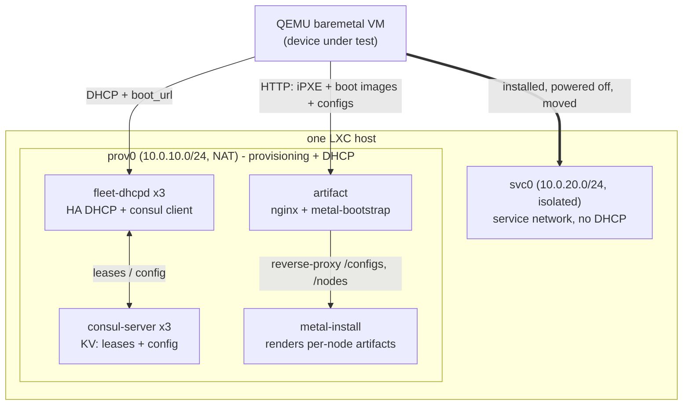

# baremetal-provisioning-sandbox

A bare-metal provisioning system (metal-install, metal-bootstrap, fleet-dhcpd)
reproduced on LXC containers, driving a QEMU virtual machine through a real
unattended install. See [DESIGN.md](DESIGN.md) for the install sequence and the
node/network detail.



## Prerequisites

On the LXC host:

```
sudo apt install lxc lxc-templates debootstrap nftables qemu-system-x86 qemu-utils ipxe-qemu
```

Tools on PATH:

- [netshed](https://github.com/zinrai/netshed)
- [declxc](https://github.com/zinrai/declxc)
- [deb-rootfs](https://github.com/zinrai/deb-rootfs)
- [netboot-guest](https://github.com/zinrai/netboot-guest), the QEMU guest under
  test. Registration with metal-install is separate (`driver/register.py` and
  `deregister.py`, in this repo, stdlib only).

metal-install, metal-bootstrap, and fleet-dhcpd are installed into the
containers by Ansible from their pinned releases; they are not needed on the
host.

## Stand up the substrate

```
sudo netshed create -config network.yaml            # prov0 + svc0 bridges
sudo declxc create  -f containers.yaml              # 8 stopped containers

# seed each rootfs: your SSH key for root, sshd + python3 for Ansible, and reset
# networking to loopback only so the guest does not run a DHCP client on eth0
# (declxc assigns the static IP; the Debian template's eth0 dhcp default would
# otherwise also pull a pool lease)
for n in $(grep -oP '(?<=name: )\S+' containers.yaml); do
  sudo deb-rootfs.py packages        --dir /var/lib/lxc/$n/rootfs --name openssh-server python3
  sudo deb-rootfs.py authorized_keys --dir /var/lib/lxc/$n/rootfs --user root
  sudo deb-rootfs.py interfaces      --dir /var/lib/lxc/$n/rootfs
done

sudo declxc start -f containers.yaml
```

## Configure with Ansible

Each playbook is self-contained (its own `ansible.cfg`, `inventory`, and
`group_vars`). Run them in order:

```
cd ansible/consul-server && ansible-playbook consul-server.yml && cd -
cd ansible/fleet-dhcpd   && ansible-playbook fleet-dhcpd.yml   && cd -
cd ansible/metal-install && ansible-playbook metal-install.yml && cd -
cd ansible/artifact      && ansible-playbook artifact.yml      && cd -
```

Order matters: fleet-dhcpd writes its config into Consul KV, so the Consul
cluster comes first. Ansible installs and configures the software here (it
enables metal-install but does not start it: the data deploy below does that).
Deploying metal-install's data, placing boot artifacts, and running the VM are
separate steps, below.

## Deploy metal-install data

metal-install's os/machines/templates are application content, deployed as a
timestamped release with an atomic `current` symlink switch, separate from
Ansible (which owns the binary, the systemd unit, and shared/env.yml). This is
also metal-install's first start. Re-run it to ship a data change, or roll back
by pointing `current` at an older release.

```
sh deploy/deploy-metal-install-data.sh
```

## Prepare boot artifacts

Fetch the kernels, initrds, and ISO that metal-install points at into the
artifact node's docroot. metal-bootstrap is idempotent (it skips files already
present and verifies sha256), so this is safe to re-run.

```
sudo lxc-attach -n artifact -- metal-bootstrap -config /etc/metal-bootstrap/config.yaml
```

## Drive the baremetal VM

Two roles: the external system that registers and deregisters the node with
metal-install ([`driver/register.py`](driver/register.py) and
[`deregister.py`](driver/deregister.py), lab specific, stdlib only), and the
QEMU guest under test (`netboot-guest`, a separate tool). netboot-guest knows
nothing about metal-install; registration is what couples a boot to an install.

```
# register the node with metal-install (POST /nodes); runs as your user
python3 driver/register.py --mac 52:54:00:12:34:56

# provision: net-boot on prov0, wait for the install to finish and power off
sudo netboot-guest.py install --mac 52:54:00:12:34:56 --disk ./guest.qcow2 --bridge prov0

# the install is done and the VM is off. deregister the node (metal-install does
# not track completion, the caller does), then bring the guest up on svc0
python3 driver/deregister.py --mac 52:54:00:12:34:56
sudo netboot-guest.py up --mac 52:54:00:12:34:56 --disk ./guest.qcow2 --bridge svc0
```

`deregister.py` also cancels a pending install before it runs. See
`netboot-guest.py <cmd> --help`, `python3 driver/register.py --help`, and
`python3 driver/deregister.py --help` for the flags.

## Verify

```
# Consul: 3 servers + 3 clients, all alive
sudo lxc-attach -n consul-server-0 -- consul members

# fleet-dhcpd config landed in KV
sudo lxc-attach -n consul-server-0 -- consul kv get fleet-dhcpd/clusters/provisioning/config

# metal-install renders a per-node artifact (register first)
curl http://10.0.10.41/configs/52-54-00-12-34-56/boot.ipxe

# boot images are served
curl -I http://10.0.10.41/images/debian/13/install.amd/linux
```

During `install`, watch the serial console: DHCP from fleet-dhcpd, the iPXE
chain, then the Debian installer, ending in power off. metal-install keeps
listing the node until you deregister it (`GET /nodes`).

## Tear down

```
sudo netboot-guest.py delete --mac 52:54:00:12:34:56 --disk ./guest.qcow2
sudo declxc destroy -f containers.yaml
sudo netshed delete  -config network.yaml
```

## License

This project is licensed under the [MIT License](LICENSE).
